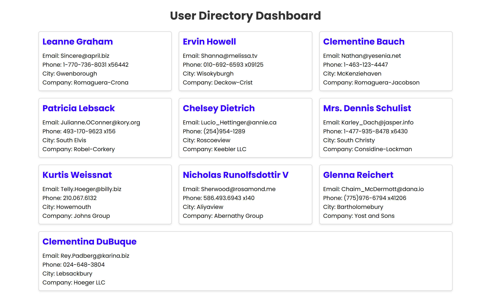

## Preview



# User Directory Dashboard

A responsive User Directory Dashboard built using Vanilla JavaScript that fetches user information from a REST API and dynamically displays it as user cards.

## Live Demo

https://gaurav-fullstack.github.io/user-directory-dashboard/

---

## Features

* Fetch user data from REST API
* Dynamic user card generation
* Display:

  * Name
  * Email
  * Phone
  * City
  * Company
* Async/Await
* Error handling
* Responsive card layout
* GitHub Pages deployment

---

## Technologies Used

* HTML5
* CSS3
* JavaScript (ES6+)
* REST API
* Git
* GitHub Pages

---

## API Used

https://jsonplaceholder.typicode.com/users

---

## Concepts Practiced

* DOM Manipulation
* Async/Await
* fetch()
* REST API
* JSON
* Arrays and Objects
* Template Literals
* Error Handling
* Dynamic Rendering

---

## Project Structure

```
user-directory-dashboard/
│
├── index.html
├── style.css
├── script.js
└── README.md
```

---

## Future Improvements

* Loading indicator
* Search users
* Filter by city
* Sort users
* Dark mode
* Better responsive design
* React version

---

## Getting Started

Clone the repository:

```
git clone https://github.com/gaurav-fullstack/user-directory-dashboard.git
```

Open `index.html` in your browser.

---

## Author

Gaurav Sharma

GitHub:
https://github.com/gaurav-fullstack

---

## Project Status

Version 1.0.0

Production Deployed ✅
